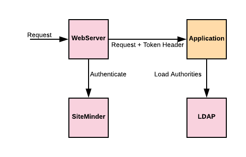

# Demo spring security siteminder pre-authentication

Assuming users are pre-authenticated using SiteMinder before accessing this application. After authentication SiteMinder passes the authenticated token in a header called SM_USER. 
While the application performs no further authentication, spring security framework can use the `RequestHeaderAuthenticationFilter` filter to extract the token from this header and
continue the flow to perform other tasks. Through the collaborating pre-authentication authentication manager and user details service the flow can for example pull users' authorities from other external system (such as LDAP).

To run the application and be able to access it, use `ModeHeader` browser plugin and provide a header named `SM_USER` 
with value `{"userName":"jsmith","firstName":"John","lastName":"Smith","isActive":true}`.
