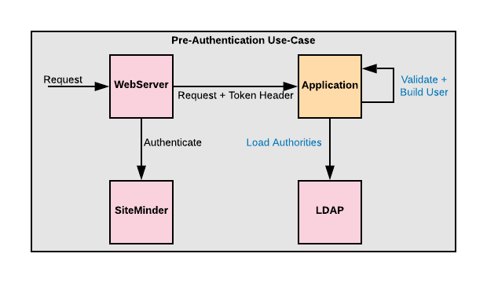

# Demo spring security SiteMinder pre-authentication

Assuming users are pre-authenticated using SiteMinder before accessing this demo application. 
After authentication, SiteMinder passes the authenticated token in a header called **SM_USER**. 
Name of the header is configurable in `application.yaml` file. 

While the application does not perform authenticate itself, spring security 
framework can use the available `RequestHeaderAuthenticationFilter` filter 
to extract the token from the header and continue the flow to perform other tasks. 

Through the collaborating pre-authentication authentication manager and user details 
service the flow can for example validate the token, pull users' authorities from other external 
system such as LDAP and build a custom user.

To run the demo application and be able to access it, use `ModeHeader` browser 
plugin to provide a header named `SM_USER` with value 
`{"userName":"jsmith","firstName":"John","lastName":"Smith","isActive":true}`, then hit `http://localhost:8080/secured/home`

---
**Reference**:
[Spring Security Pre-Authentication Scenarios](https://docs.spring.io/spring-security/site/docs/5.4.0-M1/reference/html5/#servlet-preauth)

